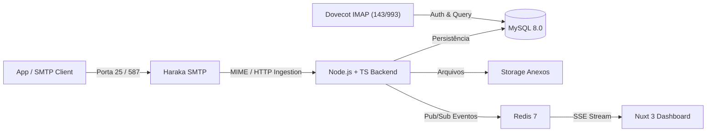

# Plataforma SMTP Sandbox — Arquitetura Completa

> Plataforma completa de e-mail sandbox com suporte a recebimento SMTP real, parser MIME, armazenamento em MySQL, interface web moderna em tempo real (Nuxt 3 + Vue 3), REST API autenticada por JWT/API Keys, Webhooks com HMAC, servidor IMAP Dovecot e orquestração Docker Compose.

---

## 🚀 Visão Geral da Arquitetura



---

## 🛠️ Stack Tecnológica

- **Backend**: Node.js 20+, TypeScript (Strict Mode), Express, `mailparser`, `mysql2/promise`, `ioredis`, `bcryptjs`, `jsonwebtoken`, `zod`.
- **Frontend**: Nuxt 3, Vue 3, TypeScript, CSS Moderno com Glassmorphism, SSE (Server-Sent Events).
- **Banco de Dados**: MySQL 8.0 (InnoDB, charset `utf8mb4`).
- **Administração de Banco**: phpMyAdmin.
- **Cache & Eventos**: Redis 7 (Pub/Sub e Rate Limiting).
- **Servidor SMTP**: Haraka (com plugins de rejeição de caixas inexistentes e ingestão modular).
- **Servidor IMAP**: Dovecot (autenticação de caixas via MySQL).
- **Reverse Proxy**: Nginx (com buffer desabilitado para streaming SSE).
- **Containerização**: Docker e Docker Compose.

---

## 📦 Inicialização com Docker

Para subir todo o ecossistema (Frontend, Backend, MySQL, phpMyAdmin, Redis, Haraka SMTP, Dovecot IMAP, Nginx):

```bash
# 1. Copie o arquivo de variáveis de ambiente
cp .env.example .env

# 2. Inicialize todos os containers em background
docker compose up -d --build
```

### URLs e Portas Padrão:

| Serviço | URL / Porta | Descrição |
|---|---|---|
| **Frontend Dashboard** | `http://localhost:3000` | Interface Nuxt 3 em tempo real |
| **Backend REST API** | `http://localhost:4000` | API REST & Swagger em `/api/docs` |
| **phpMyAdmin** | `http://localhost:8080` | Administração do banco MySQL |
| **SMTP Inbound** | `localhost:25` ou `587` | Recepção de e-mails SMTP |
| **IMAP Inbound** | `localhost:143` ou `993` | Leitura de e-mails via clientes IMAP |
| **Nginx Proxy** | `http://localhost:80` | Borda unificada |

---

## 💻 Desenvolvimento Local sem Docker

Caso queira executar os serviços Node.js diretamente na máquina:

### 1. Backend
```bash
cd backend
npm install
npm run build
npm run migrate   # Executa migrações no MySQL
npm run dev       # Inicia servidor em modo watch na porta 4000
```

### 2. Frontend
```bash
cd frontend
npm install
npm run dev       # Inicia Nuxt 3 na porta 3000
```

### 3. Testes Automatizados
```bash
cd backend
npm test          # Executa suite de testes unitários (Auth, Schema, MIME, Domínios)
```

### 4. Teste de Envio SMTP Local
Para simular o envio de um e-mail via socket SMTP:
```bash
cd backend
npm run test:smtp "teste@example.test" "remetente@externo.com" "Assunto de Teste"
```

---

## ⚙️ CLI Administrativa

O backend disponibiliza uma CLI para gerenciar entidades diretamente via terminal:

```bash
cd backend
npm run cli user:create "João Silva" "joao@empresa.com" "senha123456"
npm run cli domain:create 1 "example.test"
npm run cli mailbox:create 1 1 "teste" "senha_imap"
npm run cli mailbox:list 1
npm run cli message:list 1
npm run cli message:delete 1
```

---

## 🌐 Configuração de DNS para Produção

Para receber e-mails reais vindos de qualquer provedor na Internet (Gmail, Outlook, Yahoo), configure as entradas de DNS no seu registrador de domínio:

### 1. Registro A / AAAA
Aponta o subdomínio do servidor de e-mail para o IP público do seu servidor VPS:
```
Tipo: A
Nome: mail.meudominio.com
Valor: 203.0.113.10
TTL: 3600
```

### 2. Registro MX (Mail Exchange)
Indica onde os e-mails para `@meudominio.com` devem ser entregues:
```
Tipo: MX
Nome: @ (ou meudominio.com)
Prioridade: 10
Valor: mail.meudominio.com
TTL: 3600
```

### 3. Registro TXT — SPF (Sender Policy Framework)
Autoriza seu servidor a transitar e-mails:
```
Tipo: TXT
Nome: @
Valor: "v=spf1 mx ip4:203.0.113.10 ~all"
```

### 4. Registro TXT — DMARC
Política de conformidade e relatórios:
```
Tipo: TXT
Nome: _dmarc.meudominio.com
Valor: "v=DMARC1; p=none; rua=mailto:dmarc-reports@meudominio.com"
```

### 5. Registro PTR (Reverse DNS)
> ⚠️ **Importante**: O registro PTR (Reverse DNS) mapeia o endereço IP de volta para `mail.meudominio.com` e normalmente deve ser configurado no painel do **provedor de hospedagem / VPS** (ex: AWS Route 53 Elastic IP, DigitalOcean, Hetzner, Linode, Oracle Cloud), e não no registrador de DNS comum.

---

## 🔒 Segurança

- **Senhas Criptografadas**: Utiliza `bcrypt` com fator de custo 12.
- **Isolamento de E-mail**: O HTML recebido é renderizado em `iframe` com atributo `sandbox` restrito, evitando execução de JavaScript no contexto do dashboard.
- **Proteção Open Relay**: O Haraka rejeita imediatamente mensagens destinadas a caixas postais inexistentes com código `550`.
- **Assinatura de Webhooks**: Cada evento disparado inclui a assinatura `X-Sandbox-Signature: HMAC-SHA256(payload, secret)`.
- **Rate Limiting**: Proteção de força bruta e sobrecarga baseada em Redis.

---

## 📂 Estrutura de Pastas

```
├── /backend         # API REST Node.js + TypeScript
│   ├── /src
│   │   ├── /auth           # JWT, API Keys, Hashing
│   │   ├── /controllers    # Handlers HTTP
│   │   ├── /database       # Pool MySQL, Migrations, Redis
│   │   ├── /events         # SSE & Redis Pub/Sub
│   │   ├── /middlewares    # Auth, Rate Limiter, Error Handler
│   │   ├── /models         # Schemas e Tipos
│   │   ├── /repositories   # Repositórios MySQL com Prepared Statements
│   │   ├── /routes         # Rotas REST
│   │   ├── /services       # Regras de Negócio e Parser MIME
│   │   ├── /validators     # Schemas Zod
│   │   ├── /webhooks       # Worker de entrega com retries
│   │   ├── cli.ts          # CLI Administrativa
│   │   └── server.ts       # Servidor principal
├── /frontend        # Interface Nuxt 3 + Vue 3
│   ├── /components  # EmailViewer, Sidebar, Navbar, Toast
│   ├── /pages       # Dashboard, Domínios, Mailboxes, Inbox, Webhooks, API Keys
│   └── /composables # useAuth, useApi, useEvents
├── /smtp            # Servidor SMTP Haraka
├── /imap            # Servidor IMAP Dovecot
├── /database        # Script init.sql
├── /nginx           # Configuração de Proxy Reverso
├── /docs            # OpenAPI 3.0 e Referência da API
├── /storage         # Armazenamento físico de anexos
└── docker-compose.yml
```
